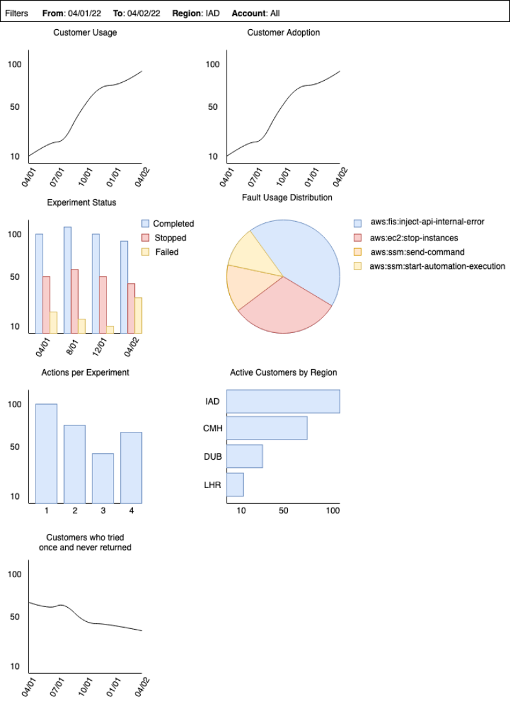

# Internship Final Report

Euan Leith 18323530

# Executive summary

The purpose of this report is to discuss the project I worked on during my internship. The goal of this project was to create a business insights system for my team, which would allow them to perform queries which give them more visibility into their service. 

### Customers

My team manages a service called AWS Fault Injection Simulator (FIS), which performs chaos engineering: testing the resilience of the customer’s system by deliberately breaking things. As a result, the sort of insights my team are interested in are both technical questions like ‘how many fault injections are being run’, and business questions like ‘how many customers are using the service’.

### Existing tools

There are some existing tools for performing these queries, but they are limited and inconvenient. Therefore my project was to create a dedicated system to overcome these issues.

### Process

Firstly, a design was created by collecting requirements from the team, then researching and comparing the components in lieu of these requirements, before producing an initial design. The end goal of this design was an initial set of insights, with the ability to expand to new insights using new data sources. Secondly, this design was implemented. This involved some changes to the initial design as new information was discovered. During this process the quality of the system was evaluated using a number of both automatic and manual systems. Finally, the efficacy of the design and the design approach were re-evaluated after the project was completed, to see what experiential knowledge could be gained.

### Challenges and Learnings

There were a number of challenges encountered during the course of this internship, which provided a number of key learnings;

* There were a large number of expected feature limitations and issues when integrating services, so it’s worth spending the time during the design phase to research this information to validate that the system works.
* Many deadlines were missed due to unexpected issues, so deadlines should always be longer than appears reasonable, since there are always unknowns.

# Design review

## Problem definition

### Problem Statement

My team lacks visibility into the data from their own service. This means that they can’t easily answer simple questions such as ‘how many fault injections are being run’; or more complex questions such as ‘how many customers are trying the service once and never returning’, or ‘what is the projected change in the number of fault injections run’.

### Customers

There are two distinct use cases for querying this data; one focused on providing business related insights (e.g. customer adoption and retention); and another on operation insights (e.g. why did an injection fail).

### Existing tools

There are a number of existing tools for querying this data, but they are limited. Business users have the option to view an existing dashboard; and to ask engineers to perform queries manually. Operational users can query the data directly.

Limitations with existing tools:

* Business users
    * The existing dashboard is limited to a small set of insights; has no capability for adding new insights; and is limited to time series.
    * Having engineers perform queries is time consuming; and those queries are limited to single points in time, meaning trends can only be tracked by performing multiple manual queries, which takes even more time.
* Operational users
    * Each region has to be queried individually, which is time consuming
    * Many particular queries are hard or tedious to perform due to the unstructured nature of the data, being both split across multiple sources, and within each source having varying levels of structure

I had worked on a project during a previous internship which attempted to resolve this issue, however that service was also limited:

* It was region specific, meaning each region had to be queried individually, and no cross-region queries could be performed
* Parts of the system had to be created manually for each region, which was significantly time consuming.

### Proposed Solution

In order to satisfy the requirements and resolve all of the limitations described above, a dedicated insights and querying system was proposed, see figure 1. 

This system uses logs emitted by the service as the source of data. This data contains information regarding injections that are performed such as when they started, who created them, and what actions were performed. This data is sufficient for many of the use cases requirements of the users, however the system can be expanded to other data sources as required.

* There are log groups in multiple different regions, each of which is exported to an S3 bucket in the same region, which is an object store. 
* This export is achieved using Kinesis Firehose, which manages the streaming of data with automatic scaling. 
* The data in these regional buckets is then replicated to a global S3 bucket.
* This data is then transformed using a Glue Job to the desired schema and sent to a separate folder in the same bucket. A Glue Job is a serverless service which allows for a function to be run, and provides automatic scaling for larger loads of data.
* The schema of the data is then automatically discovered using a Glue Crawler, creating tables with the schema in Athena.
* The data can then be accessed through direct SQL queries with Athena, or through a dashboard in Quicksight.

Figure 1: Design diagram for the system

## Description of the design approach

The design for the system was created in two parts. Firstly, an initial design was created by collecting use cases from my team in order to understand their requirements; and researching and comparing the available options. As well as this, a mockup of the final product was created. Secondly, this design was iterated on during the course of the implementation.

### Use Cases

#### Use Case Gathering

In order to determine the requirements of the system, a set of use cases were gathered. This was crucial for this project due to my lack of knowledge of the service, and lack of experience with the particular queries that might be useful to perform. 

Use cases were first gathered through an informal approach, wherein engineers were asked to provide a list of insights they were interested in. However this proved to be a poor strategy as engineers were providing use cases they thought would be interesting, rather than those that would be practically useful. 

Therefore it was determined that a survey was to be run, which would allow for more pointed questions. These questions asked for real instances where engineers had to query the service’s data, and issues that were faced with the existing tools; therefore avoiding any queries which might be interesting but wouldn’t provide much utility.

#### Whittling Down

The survey generated a large number of use cases, and so needed to be whittled down to a smaller set which could demonstrate the features and potential of the system. For this reason, use cases were chosen for their usefulness, as well as to demonstrate a wide range of possibilities. For example, the use case of customer usage was chosen as an example of an insight into general business trends; whereas the insight of the most used faults could be used to determine future features, in this case what future faults to add.

### Research

#### Standard design approaches

The first step in researching was to understand the standard design approach(es) for a type of system being built. This would provide a list of necessary components; and then various options for each of those components could be researched and compared with one another, as well as their interaction with the rest of the system.

#### Limiting options

There were cases where there were too many options for all to be practically considered, especially in the case of the visualisation tools. In these cases the options had to be limited somehow. The decision was made to limit the options by popularity, since this is a rough approximation of quality. This might not be true if only a single option is considered, but as more popular options are considered, there is likely at least one which is of high quality. This approach means that a better solution potentially exists, but with a limited amount of time available for research this compromise had to be made.

#### Sources

There were two distinct sources of information;

**AWS Documentation**

* Advantages
    * More reliable since the source is official.
    * Contains detailed specifications and pricing

**External web pages**

* Advantages
    * Contains information comparing tools with one another.

The reliability of the source was a necessary component of good research. Furthermore the comparisons between tools on the external web pages were in many cases influenced by the personal experience of the writer, further reducing the reliability of the source. For these reasons, only official documentation was used when performing research.

#### Comparing options

There were both simple and complex comparisons that had to be made between the various options. Where one tool had a feature and another didn’t, there was a simple solution: the former was preferable. However if one tool had some feature x but not feature y, and another tool had some feature y but not feature x, the comparison was not as simple, since the items were different in kind. In these cases, the decision was determined both by the requirements of the users, and the designers discretion, since the solution was not clear-cut. In these cases, consensus was crucial to reaching an effective solution, in order to mitigate any personal biases. 

### Mockup

A mockup of the dashboard was created for a number of reasons;

* To provide customers with an impression of the final product, to determine if any changes in the requirements should be made. 
* To provide a clear and concise demonstration of the various features. For example, features such as filtering, and data being collated from multiple regions were clearly conveyed, as seen in figure 2

Figure 2: mockup of the final dashboard, demonstrating the various features of the tool.

### Iterative Design

While there was an initial design for the system, this was potentially subject to change, since new information could be learned while implementing the system which was missed during the design phase.

## Implementation

### Streaming logs to regional buckets

The first step of the implementation was the system for streaming logs to the regional buckets. This involved three parts; a CloudWatch Subscription Filter which streams the logs as they are generated to a given destination; a Kinesis Firehose which takes that stream as input and exports it to a given destination; and an S3 Bucket which is a store for the data. 

Firstly, an IAM role was created which was to be assumed by the Firehose. Roles are used to define access permissions. In this case, the bucket was created with limited permissions so that only the role was able to write files to it. Then the subscription filter was created, and logs started to flow to the bucket. 

### Cross-Region Replication

The next step was to replicate these files to a central S3 bucket using the built-in cross-region replication (CRR) feature. This tool replicates the files from the source to the destination with identical file name, contents, and location. Therefore information regarding the region of each file would be lost. 

The intuitive approach here might be to alter the contents of the logs or the file names to add this region information. However this is a custom function, and so would require a Lambda, which is a serverless service which allows for a function to be run. Lambdas are only lightly managed, and therefore have a number of drawbacks;

* Operational assets must be built to monitor and alarm on failure.
* There is no automatic distribution across computers, so this has to be manually managed when the amount of data being transmitted becomes too large to run on a single computer.
* Since the functionality of the Lambda is written by the user, they’re more prone to error.

For these reasons, Lambdas should be avoided where possible in lieu of a managed tool. 

There was another option for retaining regional information which doesn’t require a Lambda. Firehose has the option of exporting to a particular path within the destination bucket. The regional information can be maintained here by storing each file under a path containing its region. Then, when replicated to the global bucket, each file will be stored under its corresponding region.

### Athena

All of the logs from each region were now stored in a single bucket. But in order for this data to be queryable by Athena, a few changes had to be made.

#### Gzip compression

The cloudwatch subscription filter exported data compressed with gzip. This normally wouldn’t be an issue for Athena, since it can recognise gzip files. However it can only do so if the file contains the extension ‘.gz’, which wasn’t added by Cloudwatch. So a change had to be made. There were two options; 

* A Lambda could be added which either adds the ‘.gz’ extension, or decompresses the files, but as previously explained we wanted to avoid using a Lambda where possible. 
* Another potential solution was to use a feature of Firehose which converts the format of the input. Athena also accepts files in the parquet format, so long as they contain the extension ‘.parquet’; and when Firehose converts the format of the file, it adds the appropriate extension. 

The Firehose solution was preferable since it avoided using a Lambda. However compressed data couldn’t be converted to parquet without first being decompressed, since the actual contents of the data needed to be known. So this approach wasn’t feasible, and a Lambda had to be used.

#### Data format

The format of the logs data wasn’t standardised, meaning some log lines were space-delimited, some were JSON, and others were a non-standard pseudo-JSON. This made basic queries long and inconvenient; and in the case of the pseudo-JSON, it made querying impossible, meaning that the data itself had to be changed. There were two options here;

* Switch to using DynamoDB as the data source.
* Update the log line with standard formatting. 

The problems with DynamoDB have already been explained; and the issue wasn’t with the nature of logs generally, but the particular logs being used, so the latter option was chosen.

#### Finished Product

With these steps completed, the Athena tables were created and could now be queried, as seen in figure 3.

Figure 3: a query being performed in Athena.

### Operational Assets

As previously explained, since a Lambda was added operational assets needed to be added. Specifically, alarms needed to be created to trigger when any issue with the Lambda occurs. Furthermore, a dashboard was created to keep track of the Lambda, and potentially preempt any issues.

### Moving to Gamma

Currently the service was only in beta, meaning that it was only testing a single region. So the next step was to move to gamma to test in all regions.

#### Creating new accounts

The standard approach is to create separate accounts for each region and stage to minimise the blast radius in the case of a failure. Therefore new accounts would need to be created for each region. This is usually done using a service which is hard to test or debug. However, there was also a newly released package which proposed to fix these issues. Since this package was relatively new it had a number of limitations, but it was suitable for this task.

#### Using existing accounts

The existing approach required that a new account and Lambda to be created for each region. However another option would be to move the regional section of the service into the existing core service accounts; and create a single Lambda which processes the data once it reaches the global bucket. Comparing the options:

**New accounts**

* Disadvantages
    * Have to create a package for creating these new accounts.
    * Have to manage new accounts for each region.
    * Have to create and manage operational assets for the Lambda in each region.

**Existing accounts**

* Disadvantages
    * Deployment time would be longer as it’s being deployed alongside the rest of the core service.
    * Larger blast radius in the case of failure.

If the service is moved to the existing accounts, a failure has the potential to influence other services since they are in the same account. However this is highly unlikely. Furthermore the deployment time isn’t a significant consideration. Therefore the downsides to this approach are relatively insignificant, so it was chosen over creating new accounts.

#### Creating a new log

Alongside this change, the data source was changed to a log which was newly created specifically for this service. This would give us more control over the contents of the log in service of the requirements of the system. Specifically, it allowed us to standardise the format of the logs, making them easier to parse with Athena; and it also provided the potential to add any other desired fields in the future as new use cases arose, meaning that data could be collected from a single source, rather than a disparate collection of sources.

### Glue

At this time, in order to query Athena, the tables had to be created manually to describe the schema of the data. However this process can be automated using a Glue Crawler, which automatically discovers the schema(s) of the data it’s provided, and creates table(s) accordingly. This step went through a number of iterations before the final design was chosen. 

#### First approach

The logs were in a different format from the desired tables, so the first approach was to add a classifier for each table to describe the desired schema. This in turn required a crawler for each table. 

**Problem:** Once this was implemented, queries in Athena returned no results. It turned out that there was a bug in Athena with classifiers running on json data, so this approach wouldn’t work. 

#### Second approach

The second approach was a work-around to this issue. The data could first be converted into parquet format, then the classifiers could be run. This would require a custom function, and therefore a Lambda or a Glue Job, and the subsequent operational assets.

**Problem:** If a function was being used, the describing of the schema might as well be done there, instead of having multiple crawlers describe the schema. And furthermore this function could also perform the function of the existing Lambda, meaning no greater operational cost. 

#### Third approach

The third and final approach was to have a function which both decompressed the logs to make them readable by Athena, and transformed the data into the desired schema. Then a crawler could be run on this data, without any classifier since the data was classified by the function.

This function could be either a Lambda or a Glue Job, comparing the two:

**Glue Job**

* Disadvantages
    * Slower for small amounts of data

**Lambda**

* Disadvantages
    * Potentially requires reworking for larger amounts of data
    * Harder to partition data

Using a Lambda would be faster for smaller amounts of data, and potentially large amounts too. But Lambda is limited to a single computer with limited memory, meaning that for larger amounts of data, distribution would have to be implemented manually. This would potentially be hard to implement, and incur significant operational costs. For these reasons, it was decided to use a Glue Job.

### Quicksight

The tables were now being created dynamically, and queryable in Athena. The next step was to create the Quicksight dashboard. This initial dashboard was to be made up of a selection of use cases chosen during the design phase. This required a number of changes to the data schema due to limitations in Quicksight. For example, Athena stores json objects in a non-standard format, so json fields had to be changed to string fields containing valid json objects. 

With these changes made, the dashboard could be created with the initial use cases, as seen in figure 4.

Figure 4: Quicksight dashboard with initial use cases.

## Evaluation / Testing

### Design Review

The proposed design of the system was evaluated by the team during a design review meeting. This involved a period of reading through the design document and providing comments, followed by a discussion period, in which the decisions made and possible alternatives were discussed. Then once any updates were made, the design was signed off by my manager before the implementation began.

### Code Reviews

Each commit has to be reviewed and approved by at least two teammates in order to assure quality. This often misses implementation issues which would be better found through unit/integration testing, and is more for style and design review.

### Pipelines

All pushed code has to flow through a pipeline with beta and gamma stages before reaching production. The beta stage builds the service in a single region in order to test the core functionality. The gamma stage then tests a build which is identical to the production environment, so that by the time 

If there is a build issue at any stage, the protocol is to roll back first instead of pushing a fix. This is because a fix might take some time, while a rollback can be performed immediately, thus minimising the time spent impacting the customer.

### Unit testing

The code itself was tested with unit tests to validate that it was working as intended. These were of two types;

* Infrastructural unit tests to confirm that all of the infrastructure was being correctly created
* Code unit tests, which were more standard tests used to validate that a piece of code was functioning properly.

Typically, integration testing would also be performed to validate the integration between parts, however this wasn’t applicable for this system. Tests were instead performed by creating an identical system just for testing, and testing in beta. This meant that changes could be tested quickly without having to go through code review and be pushed through the pipeline; and they wouldn’t interfere with the production system. 

### Security Evaluation

Once a service is made generally available, it is put through an automated security evaluation. This flags any security risks which need to be resolved.

### Alarms and Dashboards

In order to evaluate the system on an ongoing basis, alarms and dashboards are created. These alarms notify an engineer of any failures; and the dashboards can be used to monitor for any issues missed by the alarms, or to preempt future issues.

## Analysis / Critique of the design

### Design Approach

There is a spectrum of design approaches between iterative design, where there is an initial design which is subject to change, and traditional design, where the design is fully validated during the design phase, and is not subject to change. Each of these have advantages and disadvantages;

**Iterative design**

* Disadvantages
    * Potentially makes the implementation take longer. Unexpected issues can reveal extra work that needs to be done, or require reworking of completed sections.
    * Hard to create accurate deadlines, as unknowns could increase or decrease implementation time.
    * The system might be impossible to build due to unexpected limitations.
    * Hard to determine if the system will be, for example, too slow

**Traditional design**

* Disadvantages
    * While the initial investigation validated that the system works, it’s still possible for the system to be, for example, too slow, thus requiring reworking.
    * The design phase takes longer.
    * The initial design can’t be improved upon if a better solution is discovered.
    * This approach isn’t viable where the requirements are vague or unknown.

The methodology of this project leaned more towards iterative design for two main reasons; firstly because there was no need for strict deadlines; and secondly in order to start the implementation process as quickly as possible. But seeing as we hit so many issues, in hindsight we should have spent some more time validating the efficacy of the design. More specifically, we should have validated the integration between services, thus avoiding the issues we had with Athena, Glue, and Quicksight.

### Design

#### Visualisation

There are a large number of options for visualisation tools, so compare the most popular:

<table>
  <tr>
   <td>
   </td>
   <td><strong>Quicksight</strong>
   </td>
   <td><strong>Kibana</strong>
   </td>
   <td><strong>Grafana</strong>
   </td>
   <td><strong>CW Dashboard</strong>
   </td>
   <td><strong>Looker</strong>
   </td>
  </tr>
  <tr>
   <td><strong>CFN Support</strong>
   </td>
   <td>✅
   </td>
   <td>✅
   </td>
   <td>❌
   </td>
   <td>✅
   </td>
   <td>❌
   </td>
  </tr>
  <tr>
   <td><strong>SDK/Automation</strong>
   </td>
   <td>✅
   </td>
   <td>✅
   </td>
   <td>❌
   </td>
   <td>✅
   </td>
   <td>❌
   </td>
  </tr>
  <tr>
   <td><strong>ML Integration</strong>
   </td>
   <td>✅
   </td>
   <td>❌
   </td>
   <td>❌
   </td>
   <td>❌
   </td>
   <td>❌
   </td>
  </tr>
  <tr>
   <td><strong>Wiki integration</strong>
   </td>
   <td>✅
   </td>
   <td>✅
   </td>
   <td>❌
   </td>
   <td>❌
   </td>
   <td>❌
   </td>
  </tr>
  <tr>
   <td><strong>Automated reports</strong>
   </td>
   <td>✅
   </td>
   <td>❌
   </td>
   <td>❌
   </td>
   <td>❌
   </td>
   <td>✅
   </td>
  </tr>
</table>

It’s clear that QuickSight was the best option here, providing the largest number of features. However in hindsight, Quicksight is relatively limited in the custom queries it can perform, meaning that much of this work had to be done in the Glue Job. Therefore it might have been worth considering lower level visualisation libraries which were more malleable.

#### Data Source(s)

There are two options for the data source; a DynamoDB database, which is the FIS data store; and the logs emitted by the service. These logs are poorly formatted, and don’t contain all of the necessary data. So a new log would have to be created, which is well formatted, and contains the required data. Comparing the two options:

**DynamoDB**

* Disadvantages
    * This has a limited number of read units, meaning that only so much data can be read per unit time. This is also the main data store for FIS, meaning that other systems will also be reading from it. Therefore adding another reader will reduce the speed of those other systems.
    * Can’t add new fields as this is the main data store. Therefore would have to get those fields from a separate data source.

**New log**

* Disadvantages
    * Have to commit to the core system to add the log
    * Would only have data from after the creation of this log, meaning older data would have to be backfilled.

Reducing the speed of other systems in the service was a significant downside. And this system is meant to be extensible as new queries are required, meaning that the inability to add new fields would remove a feature of the system. Creating a system for backfilling older data would require additional work, and that older data would lack some required data. However for operational users this is irrelevant, as they are only concerned with recent events; and business users are more interested in current and future trends. For these reasons a single newly created log is preferable.

#### Data Storage

One of the features of the service is cross-region functionality, however the data source is per-region. To resolve this, data can be combined from each region together in a single region, while retaining a region flag to allow for querying by region. There were a few options for this; S3 has a fully managed tool for this cross-region replication (CRR); and this process could also be done manually with a Lambda, alongside any data storage tool. Comparing the options:

<table>
  <tr>
   <td>
   </td>
   <td><strong>S3</strong>
   </td>
   <td><strong>Opensearch</strong>
   </td>
   <td><strong>Redshift</strong>
   </td>
  </tr>
  <tr>
   <td>Built-in error handling
   </td>
   <td>✅
   </td>
   <td>❌
   </td>
   <td>❌
   </td>
  </tr>
  <tr>
   <td>Built-in CRR
   </td>
   <td>✅
   </td>
   <td>❌
   </td>
   <td>❌
   </td>
  </tr>
  <tr>
   <td>Reliability
   </td>
   <td>✅
   </td>
   <td>❌
   </td>
   <td>❌
   </td>
  </tr>
  <tr>
   <td>Maintenance cost
   </td>
   <td>✅
   </td>
   <td>❌
   </td>
   <td>❌
   </td>
  </tr>
  <tr>
   <td>Speed
   </td>
   <td>🟧
   </td>
   <td>✅
   </td>
   <td>❌
   </td>
  </tr>
  <tr>
   <td>Price
   </td>
   <td>✅
   </td>
   <td>✅
   </td>
   <td>❌
   </td>
  </tr>
</table>

Redshift clearly isn’t a good option, both lacking in features and quantitative factors (speed etc.), so the choice is between S3 and Opensearch (OS). 

* The speed difference between S3 and OS is only a few seconds, which is insignificant for the use cases of this service. 
* For operational users, reliability is a crucial factor: if something is broken and urgently needs to be fixed, the querying system also being broken is a significant issue. 
* The built-in error handling and CRR will mean a shorter implementation time, but this isn’t a significant factor unless the difference is extreme. However since these features are managed by the service, the maintenance cost will be reduced. 

For these reasons, S3 appears to be preferable to OS. We now have the option of using managed CRR, or manually implementing CRR using a Lambda. Compare the two:

<table>
  <tr>
   <td>
   </td>
   <td><strong>S3 CRR</strong>
   </td>
   <td><strong>Manual CRR w/ Lambda</strong>
   </td>
  </tr>
  <tr>
   <td>Fully managed
   </td>
   <td>✅
   </td>
   <td>❌
   </td>
  </tr>
  <tr>
   <td>Less data duplication
   </td>
   <td>❌
   </td>
   <td>✅
   </td>
  </tr>
  <tr>
   <td>Streaming
   </td>
   <td>✅
   </td>
   <td>✅
   </td>
  </tr>
  <tr>
   <td>Scheduling
   </td>
   <td>✅
   </td>
   <td>✅
   </td>
  </tr>
  <tr>
   <td>Managed triggering
   </td>
   <td>✅
   </td>
   <td>✅
   </td>
  </tr>
</table>

Data duplication is a significantly smaller issue than having to manage the lambda, which requires operational assets and lacks reliability as previously explained. Furthermore the duplication can be reduced by only holding the duplicates for, say, 2 weeks. This would be sufficient time to backfill if there is a failure; and any older data can still be backfilled by exporting the logs again. For these reasons managed CRR is preferable.

# Conclusions

The goal of this project was to design and build a business insights system for my team. This goal was achieved, and an initial set of use cases is available in the Quicksight dashboard. Custom queries can also be performed using Athena. However a number of deadlines were missed due to unexpected limitations in the tools used. As a result, there wasn’t time to expand beyond this initial set of use cases.

## Contributions

Through this project I had the opportunity to contribute to a number of facets of the software development process.

**Design**

* I gathered use cases from my customers in order to understand their requirements.
* I researched and collected the various potential solutions in lieu of these requirements.
* I analysed these options to determine which combination would produce the best product.
* I had this design reviewed by my team and iterated upon in accordance with their comments.
* I then iterated upon this initial design through the course of the implementation as new information was learned.

**Implementation**

* I used a wide variety of public AWS services, which provided me with experience of the SaaS model.
* I used a wide variety of internal tools, which gave me experience with the development and organisational process of a large software development company.

**Evaluation**

* I built systems for validating and evaluating the quality of my service
* My product went through the existing validation and evaluation processes, and was improved in response to these systems.

**Teamwork**

* I worked closely with a subteam of three people to discuss and implement decisions.
* I participated in demonstrations with the rest of my team, which improved our knowledge of each other's services.
* I communicated with people who had different levels of knowledge of my project, and thus required different considerations.

**Project Management**

* I took part in an agile development process, which involved participating in sprints, and iterative designing.
* I determined deadlines for each task.

## Learnings

#### Development Process

* It’s worth spending the time during the design phase to research the feature limitations and integration between services to validate that the system works.
* Deadlines should always be longer than appears reasonable, since there are likely to be unexpected issues.

#### Personal

* I learned a number of techniques for improving the speed of solving problems which are non-linear; simultaneously overlapping; and have limited information.
* I learned a lot about the research and decision making involved in the design process, which was something I had little experience with before this project.
* I learned about how to overcome the differences in perspective when communicating with others.

## Future Work

#### Backfill

Currently only data from the last few weeks is queryable. A backfill should be performed to export older data into the system, which will allow for insights into existing trends, and will allow for predictions into future trends.

#### Expand to other insights

Currently the Quicksight dashboard contains the limited set of use cases decided during the design phase. This can now be expanded to satisfy the needs of the team. Many of these insights will be easily created with the existing fields; however others will require more data fields. This can be achieved by either adding more fields to the existing log data source, or adding more data sources. As the system was designed to be extensible, these additional data sources can either be logs, or any other type of data, so long as they end up in the S3 bucket.
